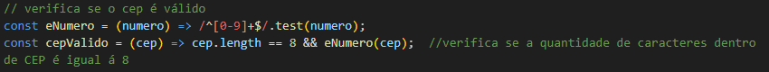
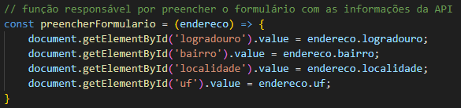
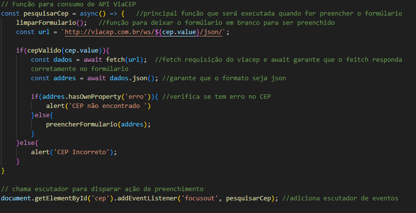

# Projeto de cadastro de Endereço com consumo de API (ViaCEP)

## Objetivo

Essa atividade tem como objetivo ciar um site aonde quando inserimos o nosso CEP, o site informa nosso endereço. Ele faz isso consultando a API do ViaCEP.


# Elementos utilizados em JavaScript

### CONST limparFormulário


* Essa função faz com que os campos selecionados que foram preenchidos anteriormente, sejam limpos automaticamente.

____________________________________________________________________________________________________

### CONST eNumero & CONST cepValido



#### eNumero
* verifica se o que foi digitado no campo, só possui caracteres numéricos.

#### cepValido
* verifica se o tamanho do numero digitado, é igual a 8, ou seja, o tamanho de CEPs.

____________________________________________________________________________________________________

### CONST preencherFormulario



* preenche os campos de acordo com o fornecido pelo API, logo após do CEP ser inserido em seu devido campo.

____________________________________________________________________________________________________
### CONST pesquisaCep




# Função `pesquisarCep`

A função `pesquisarCep` é responsável por buscar informações de endereço a partir de um CEP (Código de Endereçamento Postal) utilizando a API ViaCEP. Ela valida o CEP informado e, se for válido, faz uma requisição para obter os dados correspondentes, preenchendo um formulário com as informações retornadas.

## Como Funciona

1. **Limpeza do Formulário**: Antes de realizar a pesquisa, a função `limparFormulario()` é chamada para garantir que o formulário esteja limpo.
  
2. **Validação do CEP**: O CEP informado é validado pela função `cepValido()`. Se o CEP não for válido, um alerta é exibido informando o usuário.

3. **Requisição à API**: Se o CEP for válido, uma requisição é feita à API ViaCEP utilizando a função `fetch()`. A URL da requisição é formatada com o CEP fornecido.

4. **Tratamento da Resposta**: A resposta da API é convertida para o formato JSON. A função verifica se a resposta contém um erro, indicando que o CEP não foi encontrado. Se um erro for encontrado, um alerta é exibido. Caso contrário, a função `preencherFormulario()` é chamada para preencher o formulário com os dados retornados.

____________________________________________________________________________________________________                                                                                                                        

# Validação de CPF

```js
// VALIDAÇÃO DE CPF DIRETO NO JAVASCRIPT
 
// Adicionando escutador ao formulário
document.getElementById('cpfForm').addEventListener('submit', function(event){
    event.preventDefault();
 
    const cpf = document.getElementById('cpf').value;
    const msg = document.getElementById('message');
 
    if(validarCPF(cpf)){
        msg.textContent = 'O CPF é válido!';
        msg.style.color = 'green';
    }else{
        msg.textContent = 'O CPF é inválido!';
        msg.style.color = 'red';
    }
}
);
 
function validarCPF(cpf){
    cpf = cpf.replace(/[^\d]+/g, ''); // Remove caracteres não numéricos
 
    // Estrutura de decisão para verificar quantidade de dígitos e se todos os digitos são iguais
    if(cpf.length !== 11 || /^(\d)\1{10}$/.test(cpf)){
        return false;
    }
   
    let soma = 0;
    let resto;
 
    // Validando 10º digito do CPF - o primeiro digito verificador
    for(let i=1;i <= 9;i++){
        soma += parseInt(cpf.substring(i-1, i)) * (11 - i);
    }
 
    resto = (soma * 10) % 11;
 
    if((resto === 10) || (resto === 11)){
        resto = 0;
    }
    if(resto !== parseInt(cpf.substring(9, 10))){
        return false;
    }
    // Validando 11º digito do CPF - o segundo digito verificador
    soma = 0;
    for(let i = 1; i <= 10; i++){
        soma += parseInt(cpf.substring(i-1, i)) * (12 - i);
    }
 
    resto = (soma * 10) % 11;
 
    if((resto === 10) || (resto === 11)){
        resto = 0;
    }
   
    if(resto !== parseInt(cpf.substring(10, 11))){
        return false;
    }
 
    return true;
}
```

____________________________________________________________________________________________________

# Validação de EMAIL

```js
// CODIGO DE VALIDAÇÃO DE EMAIL
//===================================================

function checarEmail(){
    

    // Verifica se o campo de e-mail está vazio
    if (document.forms[0].email.value == "" ||

   // ou se não contém o caractere '@'
   document.forms[0].email.value.indexOf('@') == -1 ||

   // ou se não contém o caractere '.'
   document.forms[0].email.value.indexOf('.') == -1 ){

   // Exibe um alerta se o e-mail for inválido
    alert("Por favor, informe um e-mail válido");

    return false;
} else {

   // Exibe um alerta se o e-mail for válido
   alert("Email informado com sucesso")

   // Atualiza o conteúdo do elemento com id 'email' com o valor do e-mail informado
   document.getElementById('email').innerHTML = document.forms[0].email.value;
}
}
```
____________________________________________________________________________________________________
## Objetivo

Essa atividade tem como objetivo ciar um site aonde quando inserimos o nosso CEP, o site informa nosso endereço. Ele faz isso, consultando a API do ViaCEP.

##


# Tecnologias utilizadas
###  HTML
###  CSS
###  JavaScrip

# Autores 
* Ricardo Siena
* Deivid Marques


