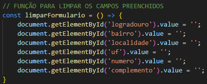

# Projeto de cadastro de Endereço com consumo de API (ViaCEP)

## Objetivo

Essa atividade tem como objetivo ciar um site aonde quando inserimos o nosso CEP, o site informa nosso endereço. Ele faz isso consultando a API do ViaCEP.

# Elementos utilizados em JavaScript

### CONST limparFormulário

* Essa função faz com que os campos selecionados que foram preenchidos anteriormente, sejam limpos automaticamente.

____________________________________________________________________________________________________

### CONST eNumero & CONST cepValido

#### eNumero
* verifica se o que foi digitado no campo, só possui caracteres numéricos.

#### cepValido
* verifica se o tamanho do numero digitado, é igual a 8, ou seja, o tamanho de CEPs.

____________________________________________________________________________________________________

### CONST preencherFormulario

* preenche os campos de acordo com o fornecido pelo API, logo após do CEP ser inserido em seu devido campo.

____________________________________________________________________________________________________
### CONST pesquisaCep

# Função `pesquisarCep`

A função `pesquisarCep` é responsável por buscar informações de endereço a partir de um CEP (Código de Endereçamento Postal) utilizando a API ViaCEP. Ela valida o CEP informado e, se for válido, faz uma requisição para obter os dados correspondentes, preenchendo um formulário com as informações retornadas.

## Como Funciona

1. **Limpeza do Formulário**: Antes de realizar a pesquisa, a função `limparFormulario()` é chamada para garantir que o formulário esteja limpo.
  
2. **Validação do CEP**: O CEP informado é validado pela função `cepValido()`. Se o CEP não for válido, um alerta é exibido informando o usuário.

3. **Requisição à API**: Se o CEP for válido, uma requisição é feita à API ViaCEP utilizando a função `fetch()`. A URL da requisição é formatada com o CEP fornecido.

4. **Tratamento da Resposta**: A resposta da API é convertida para o formato JSON. A função verifica se a resposta contém um erro, indicando que o CEP não foi encontrado. Se um erro for encontrado, um alerta é exibido. Caso contrário, a função `preencherFormulario()` é chamada para preencher o formulário com os dados retornados.

____________________________________________________________________________________________________

## Objetivo

Essa atividade tem como objetivo ciar um site aonde quando inserimos o nosso CEP, o site informa nosso endereço. Ele faz isso, consultando a API do ViaCEP.

##

# Tecnologias utilizadas
###  HTML
###  CSS
###  JavaScrip

# Autores 
* Ricardo Siena
* Deivid Marques

# Fontes 
*
